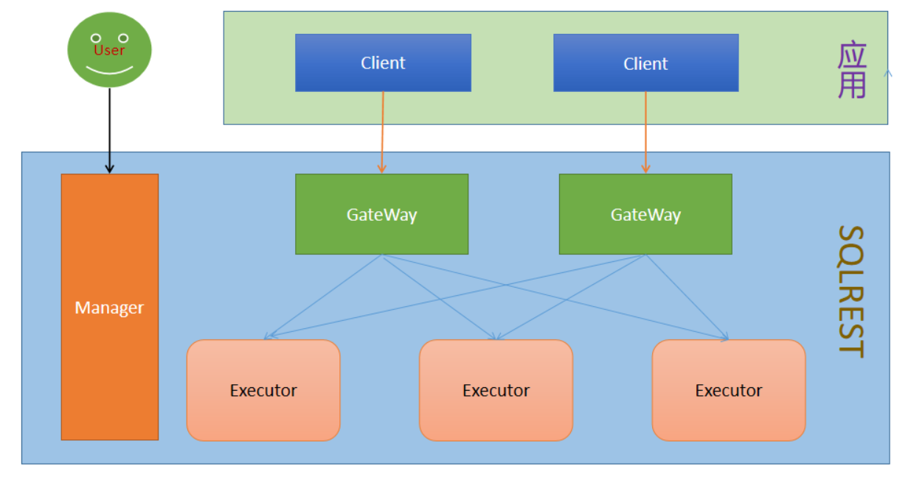

# 工具介绍

语言: [简体中文](overview.md) [English](../en/overview.md)

DataPoly ( 简称: DP ) 是一个完全开源的项目，旨在提供一种简单而强大的方式来将 SQL( 或SQL-Like，即: DSL ) 操作转化为 RESTful
API。它支持多种数据库，允许用户通过配置 SQL(或DSL) 语句来创建 API，
无需编写复杂的后端逻辑，用户只需选择数据源、输入SQL或脚本、简单path配置即可快速生成API接口。

## 1、功能介绍

DataPoly的功能包括：

- **SQL直接构建API**：通过配置增删改查SQL和参数即可生成 RESTful API。
- **多数据库支持**：支持常见的20+种数据库，其中包含多款国产数据库。
- **MyBatis语法支持**：支持MyBatis的动态SQL语法。
- **Groovy脚本支持**：支持groovy语法构建复杂场景下的接口逻辑。
- **参数类型支持**：支持整型/浮点型/时间/日期/布尔/字符串/对象等多种类型。
- **ContentType支持**：支持application/x-www-form-urlencoded及application/json等多种入参请求格式。
- **身份认证支持**：提供基于Token的认证机制，保护API安全。
- **在线接口文档**：支持自动生成swagger和knife4j等在线接口文档。
- **缓存配置支持**：支持Hazelcast或Redis缓存，提升API访问性能。
- **流控配置管理**：通过Sentinel支持流量控制，防止系统过载。
- **统一告警对接**：支持统一告警系统的对接与触发。
- **RESTful接口转发**：支持通过DSL进行HTTP数据源的RESTful接口转发功能。
- **文档数据库支持**：支持通过DSL进行MongoDB和ElasticSearch等文档数据库开发接口。
- **接口版本管理**：支持接口的版本控制管理功能。
- **批量导入导出**：支持接口的批量导入导出功能。
- **大模型MCP服务**：支持简单配置即可创建MCP的tool。

DataPoly作为微服务架构下的数据访问中间件，适合以下场景：

- **快速将 SQL(或DSL) 转换为 API**
- **适用于数据中台、BI 工具、低代码平台等**

## 2、数据库清单

截至当前，已支持的数据库包括：

- 甲骨文的Oracle
- 微软的Microsoft SQLServer(2005+)
- MySQL
- MariaDB
- PostgreSQL/Greenplum
- IBM的DB2
- Sybase数据库
- 国产达梦数据库DM
- 国产人大金仓数据库Kingbase8
- 国产翰高数据库HighGo
- 国产神通数据库Oscar
- 国产南大通用数据库GBase8a
- Apache Hive
- Cloudera Impala
- SQLite3
- OpenGauss
- ClickHouse
- Apache Doris
- StarRocks
- OceanBase
- TDEngine
- MongoDB
- ElasticSearch
- Http(RESTful)

## 3、模块结构功能



```
└── datapoly
    ├── datapoly-common           // datapoly通用定义模块
    ├── datapoly-mcp              // datapoly的MCP协议模块
    ├── datapoly-template         // datapoly的SQL内容模板模块
    ├── datapoly-cache            // datapoly执行器缓存模块
    ├── datapoly-persistence      // datapoly的数据库持久化模块
    ├── datapoly-core             // datapoly接口核心实现模块
    ├── datapoly-gateway          // Gateway网关节点
    ├── datapoly-executor         // Executor执行节点
    ├── datapoly-manager          // Manager管理节点
    ├── datapoly-manager-ui       // WEB交互页面
    ├── datapoly-dist             // 项目打包模块
```

## 4、正在规划中的功能

- **接口详情功能**: 支持接口的详细定义、数据来源、访问分析等功能。
- **语法提示增强**: 在实现的库名表名提示的基础上，基于数据库元信息的增强智能提示，强化用户体验。